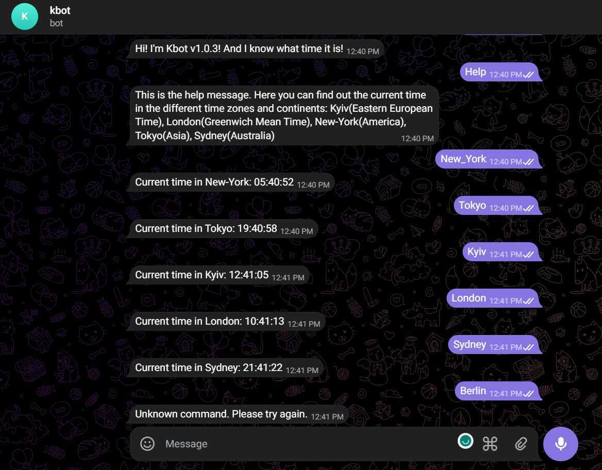

# kbot
## First telegran bot by STsariuk [t.me/stsariuk_bot](https://t.me/stsariuk_bot)

To run the bot you need to execute the next steps:
1. Clone [repo](https://github.com/STsariuk/kbot.git) in to your local machine
2. Build the go app by the command  `go build -ldflags "-X="github.com/<your repo name>/kbot/cmd.appVersion=v1.0.0`
3. Create your own telegram bot by using [@BotFather](@BotFather)
   - `/start`
   - `/newbot`
   - Create the name of yor future bot
   - Create a username for your future bot
   - Get Token to cennekt your app and telegram bot
4. Set environment variable `TELE_TOKEN` by the command `read -s <TELE_TOKEN> Enter <Ctrl+V_value_of_variable>`
5. Check if the value of env.variable is defined `echo $TELE_TOKEN`
6. Export environment variable `export TELE_TOKEN`
7. Start app `./kbot start`

